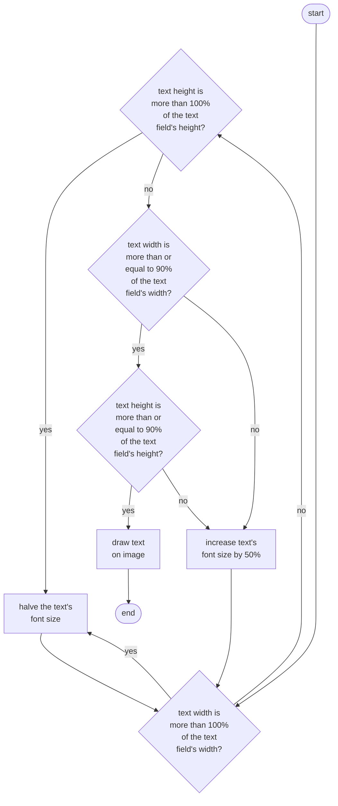

```mermaid
flowchart TD
    I --> |yes| D
    
    start([start]) ------->
    H{text width is<br>more than 100%<br>of the text<br>field's width?}

    J ---> H

    H --> |no| I{text height is<br>more than 100%<br>of the text<br>field's height?}
    
    I --> |no| F{text width is<br>more than or<br>equal to 90%<br>of the text<br>field's width?}
    

    F --> |yes| G{text height is<br>more than or<br>equal to 90%<br>of the text<br>field's height?}
    F --> |no| J[increase text's<br>font size by 50%]


    G --> |yes| C[draw text<br>on image] --> E([end])
    G --> |no| J

    H --> |yes| D[halve the text's<br>font size] --> H
```
