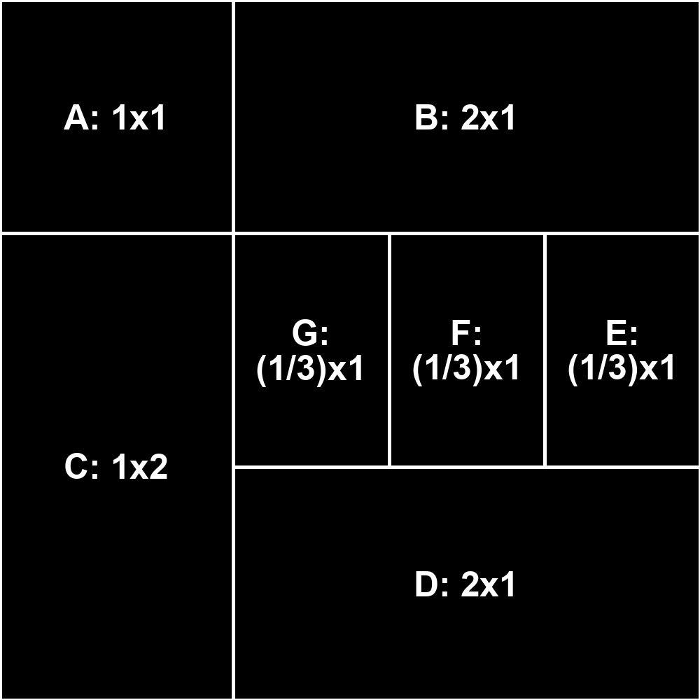
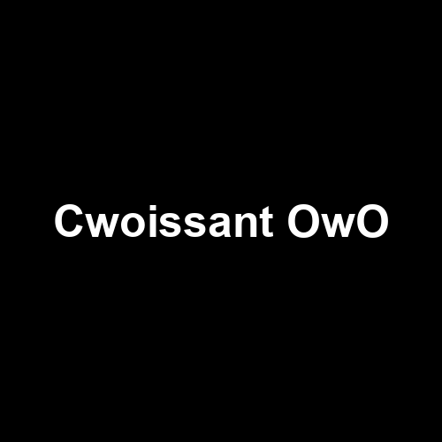

# Imagesmacker Example Images

## Code 128

Generate barcodes using the Code 128 library standard.

## Coordinates

A demonstration of using coordinates to create a purple square.

## Fields

Add fields to your image for drawing.

## Inverted Multiline

Create inverted text that spans multiple lines.

## QR

Easily generate QR codes.

## Single Line Text

Add single lines of text to your images.

## Text Anchors

Explore various options for anchoring text to specific sections of your image.

