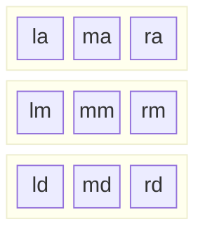

# Data Field Format

```python
DataFieldFormat(
    rows=[
        Row(
            fr=1.0,
            cells=[
                FieldCell(fr=1.0, name='la'),
                FieldCell(fr=1.0, name='ma'),
                FieldCell(fr=1.0, name='ra')
            ]
        ),
        Row(
            fr=1.0,
            cells=[
                FieldCell(fr=1.0, name='lm'),
                FieldCell(fr=1.0, name='mm'),
                FieldCell(fr=1.0, name='rm')
            ]
        ),
        Row(
            fr=1.0,
            cells=[
                FieldCell(fr=1.0, name='ld'),
                FieldCell(fr=1.0, name='md'),
                FieldCell(fr=1.0, name='rd')
            ]
        )
    ]
)
```

Will yield the following results ([mermaid.live](https://mermaid.live/edit#pako:eNp9kMtqwzAQRX8lzNo1kuVYstb9g-6KNhNLcUL1MIoETY3_vUpKQwSldzXnMpyBWWEK2oCEgw3Tx8vBJFRe-V3JFGx2_rKjv8V9Rc4x5IVK-tPdYvGZXEXxQcbrP0RdJXKVqKLo_hexSqQrUUVRP4mgAWeiw7MuL1hvtYJ0Ms4okGXU5ojZJgXKb2UVcwpvVz-BTDGbBsrd-QTyiPZSKC8ak3k94xzRPdoF_XsIFYNc4RMk5UM7cDqOnHDCaLdv4FpaKtp-ZKJk34-C9Hxr4OtuIC3vBkI4ZYLRngnebd_q4n0K)):



