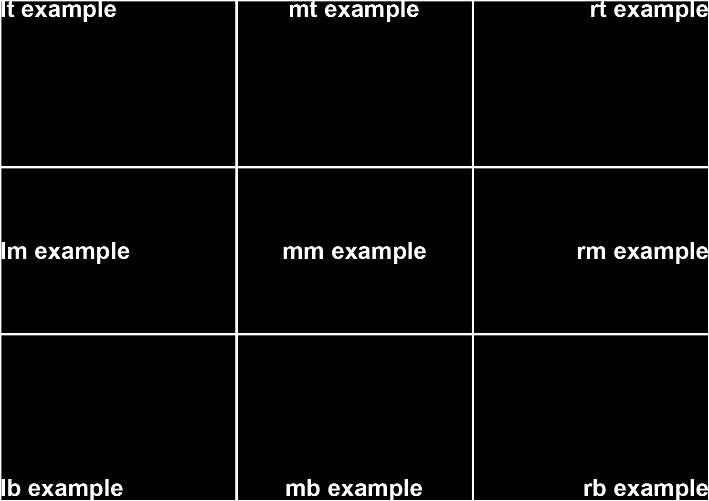

# Text Anchors

*This document is based on [Pillow's Text anchors documentation](https://pillow.readthedocs.io/en/stable/handbook/text-anchors.html)*

The `anchor` parameter determines the alignment of drawn text relative to the field coordinate. The default alignment is in the middle of the field, specifically `mm` (middle-middle). The drawing system only allows for horizontal text.
## Specifying an anchor

An anchor is specified with a two-character string. The first character is the horizontal alignment, the second character is the vertical alignment. For example, the default value of `mm` for means middle-middle aligned text.

When drawing text with `imagesmacker.draw.Draw.text()` with a specific anchor, the text will be placed such that the specified anchor point is at the `xy` coordinates.
## Horizontal anchor alignment

`l` ― left
The text is aligned to the left edge of the field.

`m` ― middle
The text is horizontally centered within the field.

`r` ― right
The text is aligned to the right edge of the field.

## Vertical anchor alignment

`t` ― top
The text is aligned to the top edge of the field.

`m` ― middle
The text is vertically centered within the field.

`b` ― bottom
The text is aligned to the bottom edge of the field.

## Examples

Below is an example of text anchors and how they behave in their fields.

%% Vertical anchor is same for multi line anchor %%